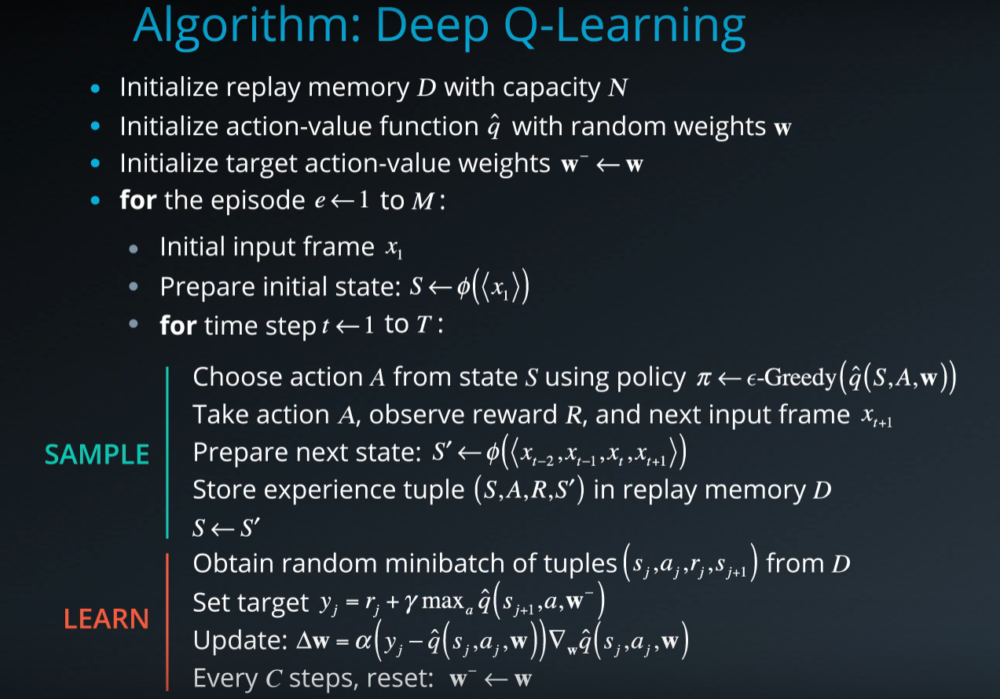
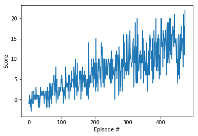

# Report
###  Learning Algorithm

### Hyperparameters

For the above algorithm, the hyperparameters are:

- Replay memory buffer size N = 100,000
- Maximum number of episodes M = 2000
- Minibatch size from learning step = 64
- Discount factor Gamma = 0.99
- Soft update of target parameters factor  = 0.001
- Learning rate alpha = 0.0005
- Target network update frequency C = 4

###  Model Architectures

The neural networks used in this project consist of three fully connected layers. The first layer has input size of 37 and output size of 64, the second layer has both input and output size as 64, and the third layer has input size of 64 and output size of 4. The first and second layer has relu function as their activation, and the third layer has linear activation function.

### Plot of Rewards

Environment solved in 375 episodes, average score is 13.04

### Ideas for Future Work

- Use pixel image as input to train the agent. Although using this method, states like velocity is harder to get, the perception of the world would be better represented since first person view contains more information than ray-based perception. Stacking multiple pixel images together as input can be a good proxy for getting velocity. 
- Use deeper neural network as the Q-network. Especially if we want to use pixel image as input, a CNN-based neural network can be implemented and can get better result than DNN